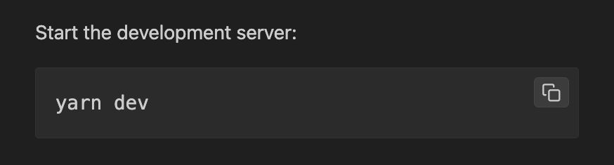

<!-- markdownlint-disable no-inline-html MD045 -->
# VS Code Markdown Styles

  
  

This VS Code extension adjusts the styles of the markdown preview.

## Features

- Adds copy buttons to fenced code blocks.
- Adds margin and padding to blockquotes.
- Adds borders to tables.
- Sets a max-width for easier reading.
- Styles checkbox in markdown preview (when [Markdown Checkboxes](https://marketplace.visualstudio.com/items?itemName=bierner.markdown-checkbox) is installed)

## Install Instructions

This extension can be installed through the VS Code Marketplace:

https://marketplace.visualstudio.com/items?itemName=ezrafree.markdown-preview

## My Other Extensions

You can check out my other extensions on the Visual Studio Marketplace:

https://marketplace.visualstudio.com/publishers/ezrafree

## My Other Projects

You can check out my other projects on my portfolio:

https://www.quietmindcreative.com/portfolio/
